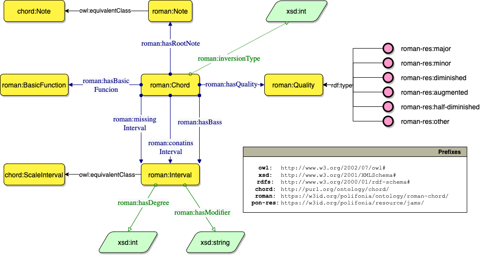

# Roman Chord Ontology
Repository for the Roman Chord ontology and its APIs.

This repository contains two types of resources:
1. [roman-chord-ontology](#the-roman-chord-ontology), an ontology for representing annotated chords in Roman Numeral format
2. [APIs](#the-roman-chord-apis) to automatically generate a Knowledge Graph built on top of the roman-chord-ontology model, 
given as input a chord in Roman Numeral notation.

## The Roman Chord Ontology

The `roman-chord-ontology` is an ontology for representing annotated chords in the Roman Numeral format. 
More specifically, the ontology represents a Roman Numeral chord and its constituent elements, such as the degrees 
that make up the chord, the root note, the quality of the chord and its basic function.

Ontology IRI:
```
https://w3id.org/polifonia/ontology/roman-chord/
```

The `roman-chord-ontology` has the following structure:



## The Roman Chord APIs

To enable an immediate conversion between chords and a Knowledge Graph based on the `roman-chord-ontology` model, APIs were implemented. 

The APIs were developed using the [FastAPI](https://fastapi.tiangolo.com/) framework, 
using the [Pydantic](https://pydantic-docs.helpmanual.io/) library to validate input and output of all functions 
that the APIs define.

The APIs are currently deployed on Heroku and are accessible at this URL: 

```
https://roman-chord-api.herokuapp.com/
```

Redirect from the `roman-chord-ontology` URI has also been implemented, so that the APIs can be accessed from the ontology's URI:

```
https://w3id.org/polifonia/resource/roman-chord/
```

You can also access the APIs' documentation at the URL:
```
https://roman-chord-api.herokuapp.com/docs/
```

### How to query the APIs

First off, it is necessary to slightly modify the syntax of the Roman Numeral Chord in order for it to be queried by the API. 
This is due to character limitations within the URL.

Indeed, the chord must not contain slash (`/`), but instead colons (`:`). 
For example, the chord `VI/ii63[no3]` will become `VI:ii63[no3]`.

It is also possible to include the chord's key within the query, to get a chord analysis for the chord considering its context (i.e. defining also its root note). 
To do this you need to insert `_key` (underscore + key) after the chord.
The key must be expressed as a capital letter followed by any modifiers (i.e. `#` or `b`), for instance `C#` for the 
`C sharp` key.

For example, to have an analysis of a fifth degree in second inversion in the key of B, the chord will become:
```
V64_B
```

You can query the API in two ways that will give two different types of output, namely:
* the analysis of the Roman Chord in **JSON format**:
  * Example query:
    ```
    https://roman-chord-api.herokuapp.com/ii53
    ````
  * Output example:
    ```json
      {
      "ii53": {
          "roman_chord":{"chord":"ii53",
          "quality":"minor",
          "inversion":0,
          "plain_roman":"ii",
          "root":"D",
          "bass":[null,"9"],
          "degrees":[[null,"9"],[null,"4"],[null,"6"]],
          "missing":[]}
          }
      }
    ```
* the analysis of the Roman Chord in **RDF format**:
  * Example query:
    ```
    https://roman-chord-api.herokuapp.com/roman-chord-ontology/IV53[no3]_C#
    ````
  * Output example:
    ```
    @prefix chord: <http://purl.org/ontology/chord/> .
    @prefix owl: <http://www.w3.org/2002/07/owl#> .
    @prefix rdfs: <http://www.w3.org/2000/01/rdf-schema#> .
    @prefix roman: <http://w3id.org/polifonia/ontology/roman-chord/> .
    @prefix xsd: <http://www.w3.org/2001/XMLSchema#> .
  
    <http://w3id.org/polifonia/resource/roman-chord/IV53[no3]> a roman:Chord ;
        roman:containsInterval [ a roman:Interval ;
                chord:degree 1 ;
                owl:sameAs <https://purl.org/ontology/scale_interval/1> ],
            [ a roman:Interval ;
                chord:degree 4 ;
                owl:sameAs <https://purl.org/ontology/scale_interval/4> ] ;
        roman:hasBasicFunction [ a roman:BasicFunction ;
                rdfs:label "IV" ] ;
        roman:hasBass [ a roman:Interval ;
                chord:degree "4" ;
                owl:sameAs <https://purl.org/ontology/scale_interval/Nbd58842099724604b05d10404eb654a5> ] ;
        roman:hasQuality <http://w3id.org/polifonia/resource/roman-chord/other> ;
        roman:hasRoot [ a roman:Note ;
                rdfs:label "F" ;
                owl:sameAs <https://purl.org/ontology/chord/note/F> ] ;
        roman:inversionType 0 ;
        roman:missingInterval [ a roman:Interval ;
                chord:degree 3 ;
                owl:sameAs <https://purl.org/ontology/scale_interval/3> ] .
    ```

# License
MIT License

Copyright (c) 2022 Andrea Poltronieri, Jacopo de Berardinis

Permission is hereby granted, free of charge, to any person obtaining a copy
of this software and associated documentation files (the "Software"), to deal
in the Software without restriction, including without limitation the rights
to use, copy, modify, merge, publish, distribute, sublicense, and/or sell
copies of the Software, and to permit persons to whom the Software is
furnished to do so, subject to the following conditions:

The above copyright notice and this permission notice shall be included in all
copies or substantial portions of the Software.

THE SOFTWARE IS PROVIDED "AS IS", WITHOUT WARRANTY OF ANY KIND, EXPRESS OR
IMPLIED, INCLUDING BUT NOT LIMITED TO THE WARRANTIES OF MERCHANTABILITY,
FITNESS FOR A PARTICULAR PURPOSE AND NONINFRINGEMENT. IN NO EVENT SHALL THE
AUTHORS OR COPYRIGHT HOLDERS BE LIABLE FOR ANY CLAIM, DAMAGES OR OTHER
LIABILITY, WHETHER IN AN ACTION OF CONTRACT, TORT OR OTHERWISE, ARISING FROM,
OUT OF OR IN CONNECTION WITH THE SOFTWARE OR THE USE OR OTHER DEALINGS IN THE
SOFTWARE.
